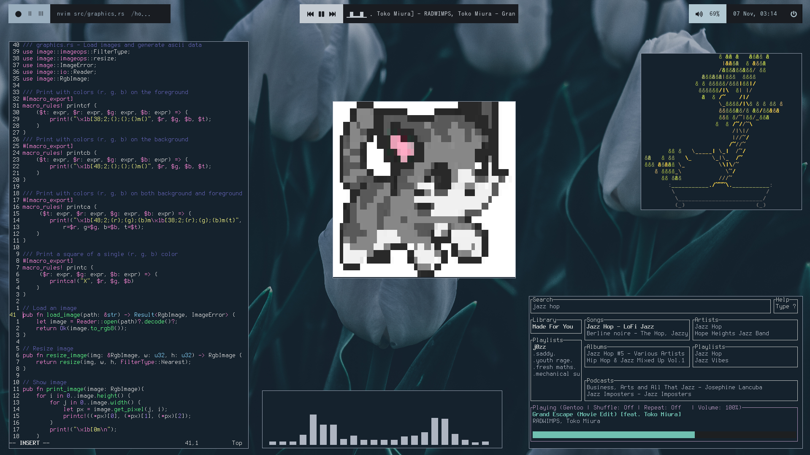
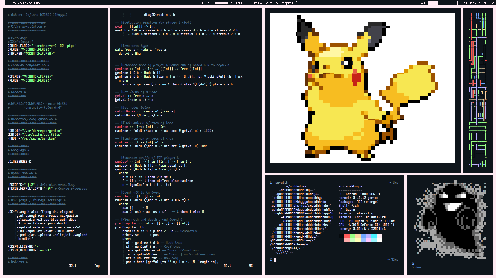

# Dotfiles
  
  

## Info
- OS: `Gentoo`
- Drivers: `nvidia (closed source)`

## Main packages
### Core apps
```
xorg
bspwm
sxhkd
pulseaudio
```
### Theme apps
```
cava
nvim
alacritty
vim-plug
rofi
polybar
neofetch
spotifyd
spotify-tui
zscroll
```

## Credits
Font [Scientifica](https://github.com/nerdypepper/scientifica)  
